Österreich gilt als reiches Land. Doch hinter den Durchschnittszahlen verbirgt sich eine Frage, auf die es lange Zeit keine klaren Antworten gab: Wie genau ist dieser Reichtum eigentlich verteilt? Wer besitzt wie viel, und wo beginnt die echte Spitze?

Lange Zeit fehlten verlässliche Daten, um das Vermögen der Privathaushalte zu messen. Das änderte sich mit dem <a href="https://www.ecb.europa.eu/pub/research-networks/html/hfcn_faq_2021_wave.en.html" target="_new">Household Finance and Consumption Survey (HFCS)</a>. Diese europaweite Erhebung der Zentralbanken liefert erstmals detaillierte Einblicke in die Finanzen der Haushalte.

Doch wie präzise sind solche Umfragen wirklich? Besonders an der Spitze der Gesellschaft ist Reichtum oft schwer zu fassen. Um herauszufinden, ob die offiziellen Zahlen das wahre Ausmaß der Ungleichheit abbilden, muss man über die Befragungen hinausblicken.

Diese interaktive Auswertung nimmt dich mit auf eine Spurensuche: Wir betrachten zuerst die bekannten Fakten und untersuchen dann, was passiert, wenn wir die &bdquo;blinden Flecken&rdquo; der Statistik ausleuchten.

::: cr-section

::: {#cr-vermoegen}
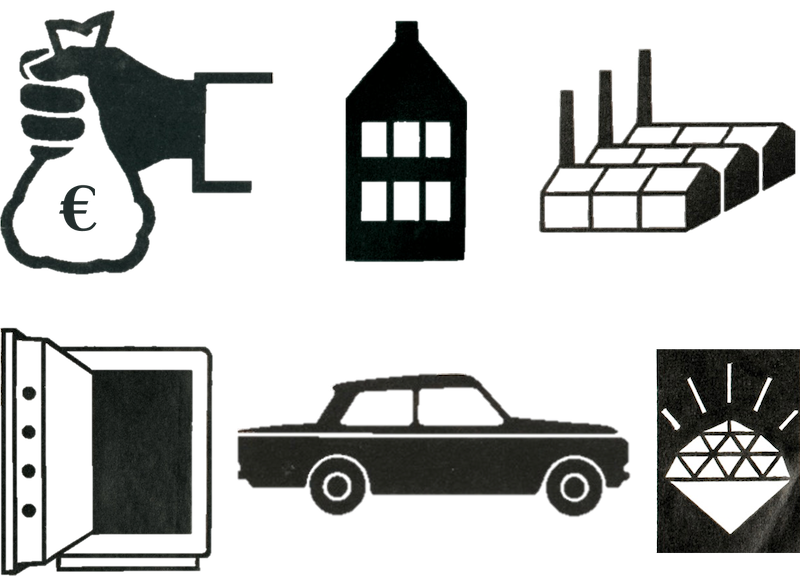
:::

::: {#cr-haushalte}
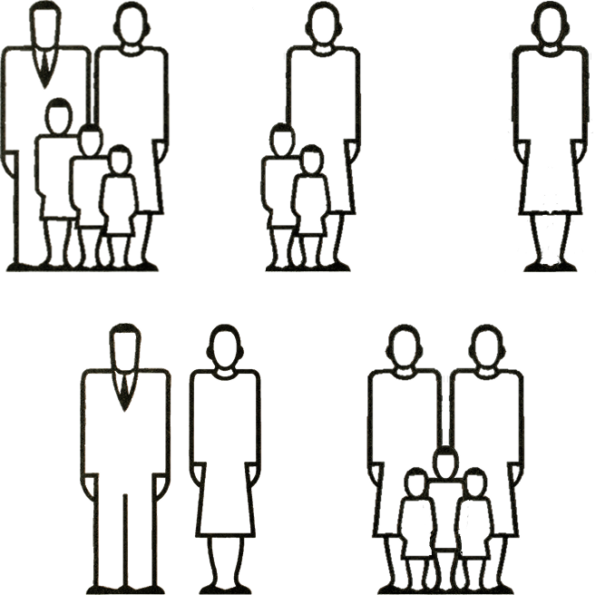
:::


::: {#cr-haus}

:::


@cr-vermoegen <span class="highlighted-text">Vermögen</span> sind alle in Geld bewerteten dauerhaften Güter und Rechte wie Grundbesitz, Wertpapiere oder Bargeld einer Person oder eines privaten Haushalts.

@cr-haushalte Der Begriff <span class="highlighted-text">Haushalt</span> bezeichnet eine allein lebende Person oder eine Gruppe von Personen, die zusammen in derselben privaten Wohnung leben und sich die Ausgaben teilen, einschließlich der gemeinsamen Beschaffung lebensnotwendiger Dinge.

In Österreich gibt es rund 4,1 Millionen Privathaushalte. Hinter dieser Zahl verbergen sich viele verschiedene Haushaltsformen, etwa Familien, Alleinlebende, Wohngemeinschaften oder Mehrgenerationenhäuser. Statistisch gesehen zählt jede Gruppe von Menschen als Haushalt, die sich eine Wohnung teilt und die Kosten für das tägliche Leben gemeinsam trägt.


::: {#cr-100-haushalte}
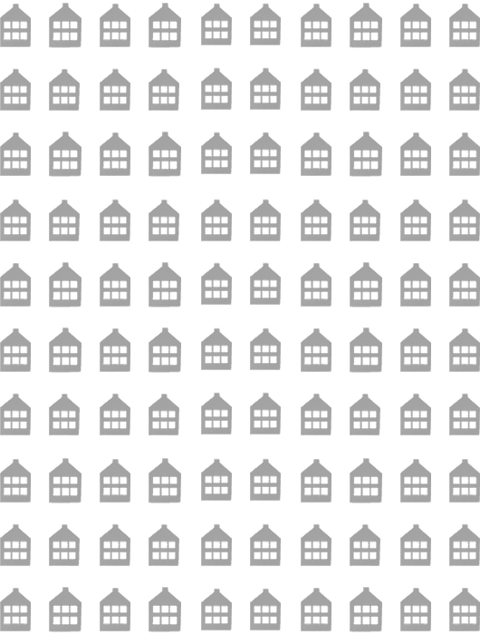
:::

::: {#cr-100-haushalte-semitransparent}
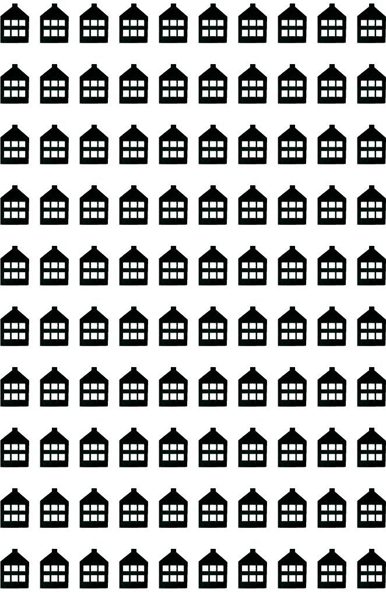{style="opacity: 0.1;"}
:::


::: {#cr-100-haushalte-untere50}
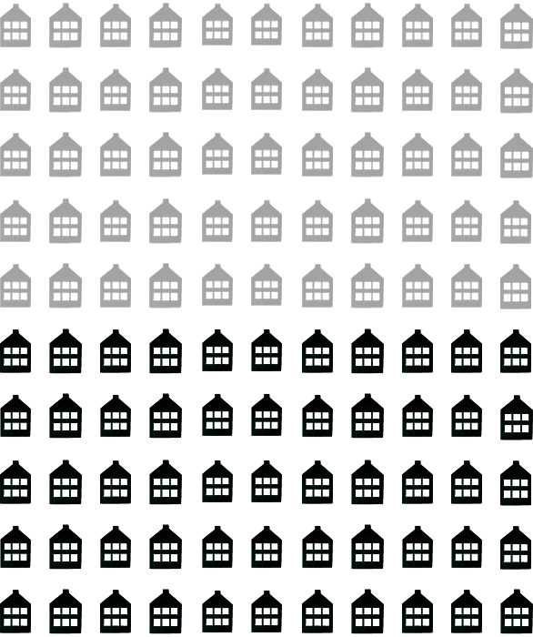
:::


::: {#cr-100-haushalte-top10}
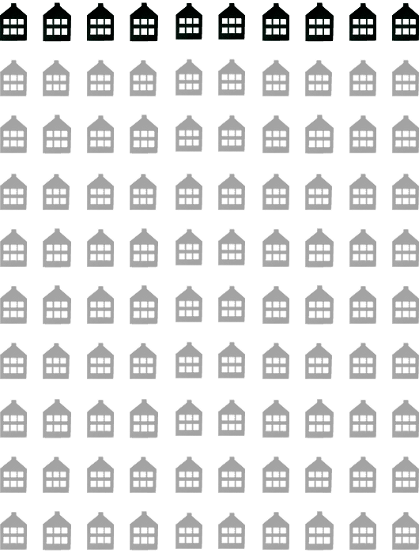
:::


::: {#cr-100-haushalte-top1}
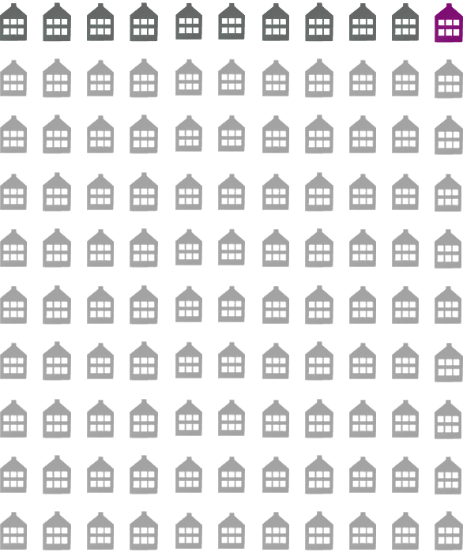
:::


@cr-100-haushalte Stelle dir vor, diese <em>100 Haushalte</em> stehen für die alle privaten Haushalte Österreichs.
<br><br><em>Ein Haushalt repräsentiert ein Prozent der österreichischen Haushalte</em>. 🇦🇹 <br><br>Jeder Haushalt besitzt ein bestimmtes Vermögen.

@cr-100-haushalte-untere50 Dann sind <span class="highlighted-text">diese 50 Haushalte</span> hier die Hälfte der Haushalte.<br><br>Wenn man die privaten Haushalte nach der Höhe ihres Vermögens ordnet, dann ist dies die  Hälfte der Haushalte <em>mit dem geringsten Vermögen</em>.

<span class="highlighted-text">Diese zehn Haushalte</span> besitzen das höchste Vermögen. @cr-100-haushalte-top10

@cr-100-haushalte-top1 Und dann gibt es unter diesen zehn Haushalten <span class="highlighted-text highlighted-text-purple">einen Haushalt</span> mit dem höchsten Vermögen.

:::

<br><br><br><br>
In dieser Grafik vergleichen wir...

\- das mittlere Vermögen der unteren Hälfte der Haushalte<br>
\- das mittlere Vermögen aller Haushalte und<br>
\- das durchschnittliche Vermögen des obersten Prozents.<br>

Mit dem mittleren Vermögen ist das Vermögen jenes Haushalts gemeint, der sich – nachdem alle Haushalte nach ihrem Vermögen sortiert wurden – genau in der Mitte befindet.
<br><br><br>

::: cr-section

::: {#cr-vermoegen-vergleich-1}
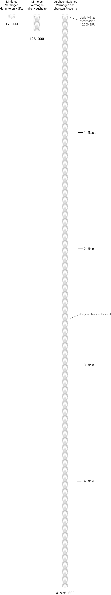{height="3600px"}
:::


[@cr-vermoegen-vergleich-1] Bitte scrollen.


[@cr-vermoegen-vergleich-1]{pan-to="0%,-20%"} Weiterscrollen!

[@cr-vermoegen-vergleich-1]{pan-to="0%,-40%"} Haushalte, die Vermögen von mehr als 2,64 Mio. EUR besitzen, gehören zum obersten Prozent.

[@cr-vermoegen-vergleich-1]{pan-to="0%,-80%"} Und durchschnittlich besitzen diese Haushalte jeweils **4,92 Mio. EUR**.


:::


<div style="width: fit-content; margin: 2vh auto;">
  <p>Also noch einmal auf einer (Computer-Monitor-)Bildschirmseite:</p></div>

<div style="width: fit-content; margin: 5px auto;">
  <p>{height="800px"}</p></div>


## Wie teilt sich das Vermögen unter den Haushalten in Österreich auf?


::: cr-section

::: {#cr-haushalte-vermoegen-start}
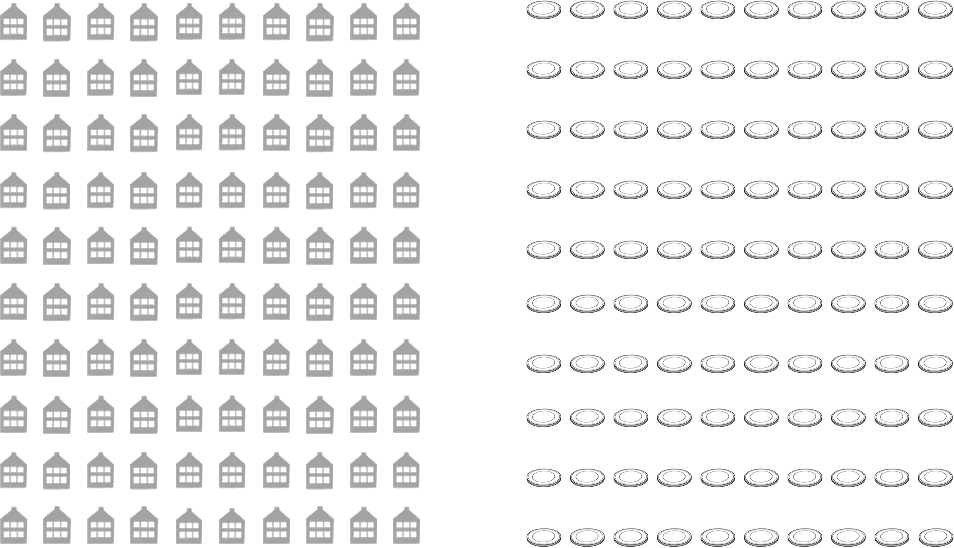
:::

::: {#cr-haushalte-vermoegen-untere50}
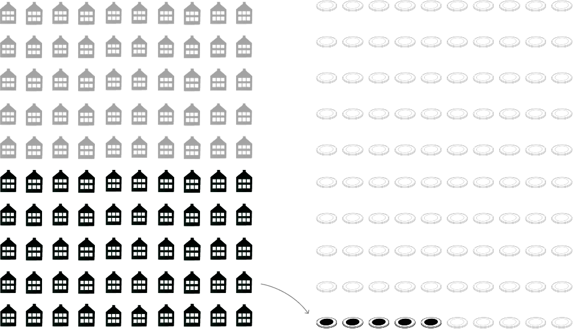
:::

::: {#cr-haushalte-vermoegen-50bis11}
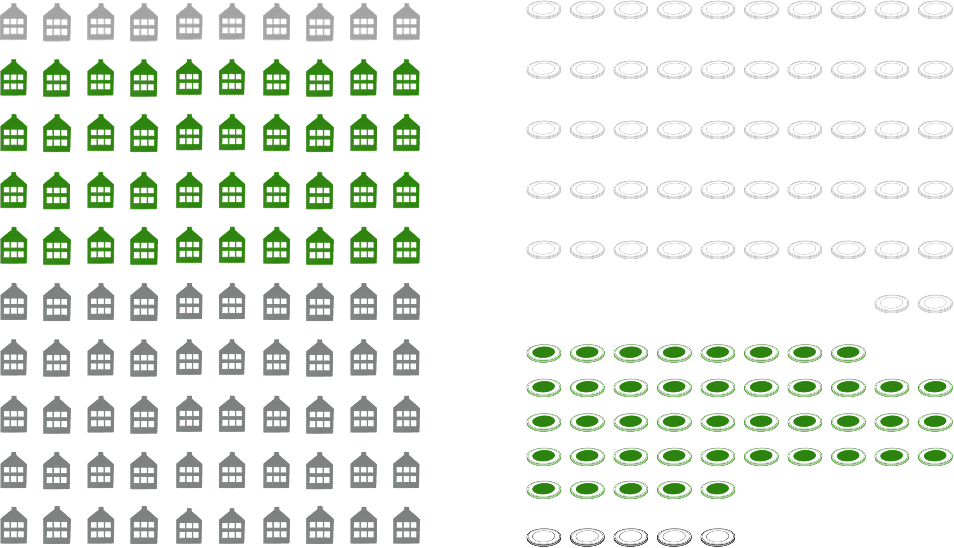
:::

::: {#cr-haushalte-vermoegen-10bis2}
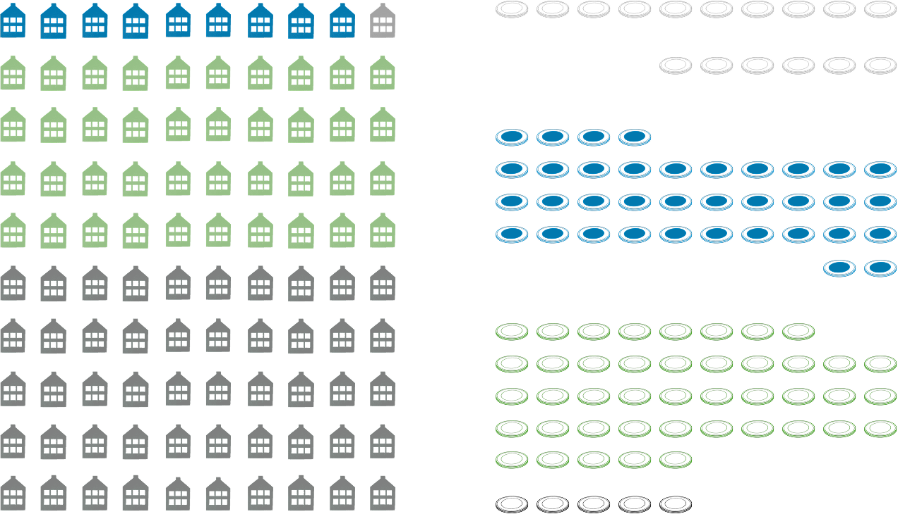
:::


::: {#cr-haushalte-vermoegen-top1}
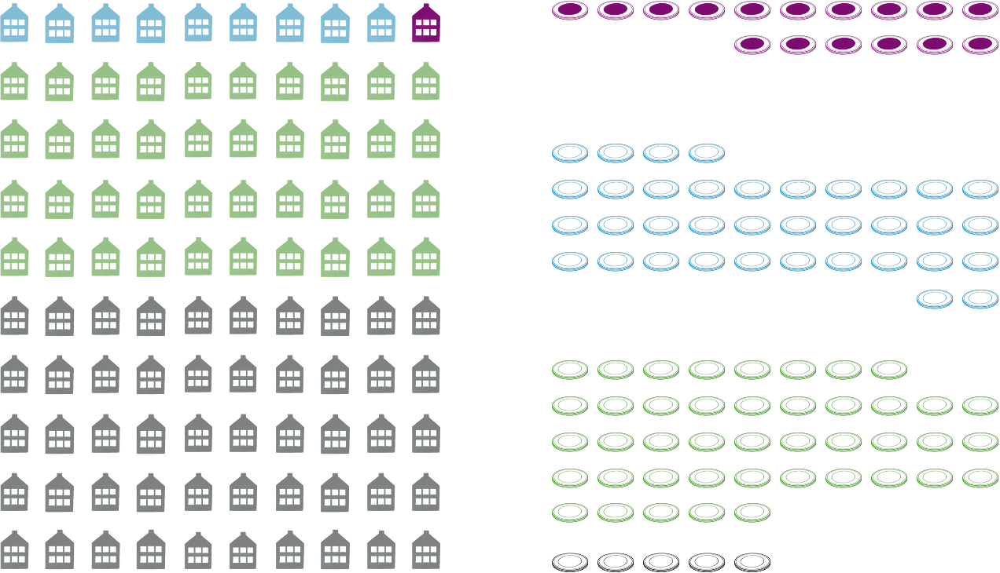
:::


::: {#cr-haushalte-vermoegen-top1-10}
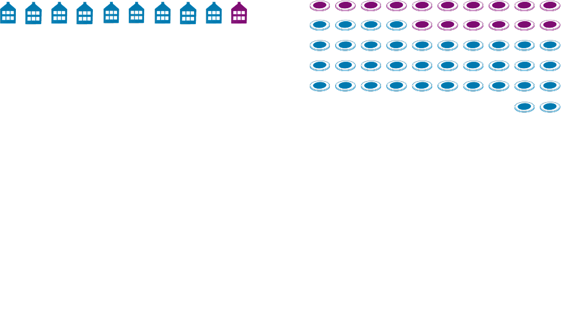
:::

::: {#cr-haushalte-vermoegen-untere90}
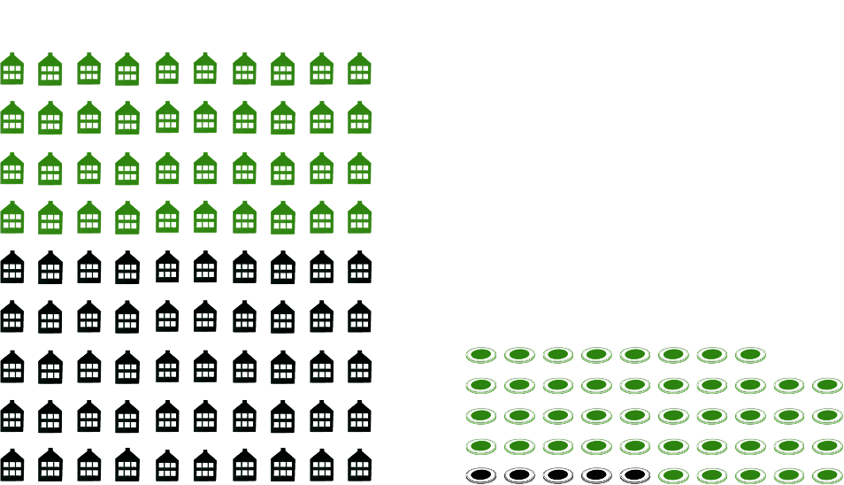
:::


@cr-haushalte-vermoegen-start Jedes Haus repräsentiert wieder ein Prozent der privaten Haushalte; jede Münze ein Prozent des Gesamtvermögens der privaten Haushalte.

@cr-haushalte-vermoegen-untere50 <span class="highlighted-text">Die untere Hälfte der Haushalte</span> verfügt über fünf Prozent des gesamten Vermögens privater Haushalte.

@cr-haushalte-vermoegen-50bis11 Die <span class="highlighted-text highlighted-text-green">nächsten 40 Prozent der Haushalte</span> (51. bis 11. Perzentil) verfügen über 43 Prozent.

@cr-haushalte-vermoegen-10bis2 Die <span class="highlighted-text highlighted-text-blue">nächsten 9 Prozent der Haushalte</span> (10. bis 2. Perzentil) verfügen über 36 Prozent.

@cr-haushalte-vermoegen-top1 Das <span class="highlighted-text highlighted-text-purple">oberste Prozent der Haushalte</span> besitzt allein 16 Prozent des gesamten Vermögens der privaten Haushalte.

Die Tatsache, dass das <span class="highlighted-text highlighted-text-purple">oberste Prozent der Haushalte</span> 16 Prozent des Vermögens aller privaten Haushalte besitzt, während die untere Hälfte der Haushalte zusammen lediglich über rund fünf Prozent verfügt, verdeutlicht die Ungleichheit der Privatvermögen in Österreich.

@cr-haushalte-vermoegen-top1-10 Die <span class="highlighted-text-gradient-purple-blue">obersten zehn Prozent der Haushalte</span> verfügen sogar insgesamt über mehr als die Hälfte (52 Prozent) der gesamten Vermögen.

@cr-haushalte-vermoegen-untere90 <span class="highlighted-text-gradient-green-black"> 90 Prozent der Haushalte</span> teilen sich die andere Hälfte des Gesamtvermögens.


<em>Aber:</em> Diese Zahlen erzählen nicht die ganze Geschichte. Es gibt ein systematisches Problem:

Große Unternehmensbeteiligungen, Stiftungsvermögen und hohe Privatvermögen werden in Haushaltsbefragungen häufig nur unvollständig erfasst.<br><br>
Wer wirklich reich ist, wird von Zufallsstichproben oft schlicht nicht erfasst. Solche Befragungen <em>unterschätzen</em> die Höhe der Vermögen besonders reicher Haushalte - und somit auch die Konzentration von Vermögen an der Spitze der Verteilung.

:::


## Was sind die Gründe für die Untererfassung vermögender Haushalte?

Für die HFCS-Erhebung wird eine Stichprobe von Haushalten in Österreich befragt. Eine ideale Stichprobe repräsentiert Haushalte verschiedener Gruppen gleichmäßig und erlaubt valide Aussagen über die Grundgesamtheit, also die privaten Haushalte in Österreich.
<br><br>
Beim HFCS sind jedoch wohlhabendere Haushalte unterrepräsentiert.

Es gibt drei Hauptgründe, warum das Gesamtvermögen und die Ungleichheit in einer Gesellschaft in Umfragen meist zu niedrig eingeschätzt werden:

::: cr-section

::: {#cr-viele-haushalte-2-lila}
<div style="text-align:center">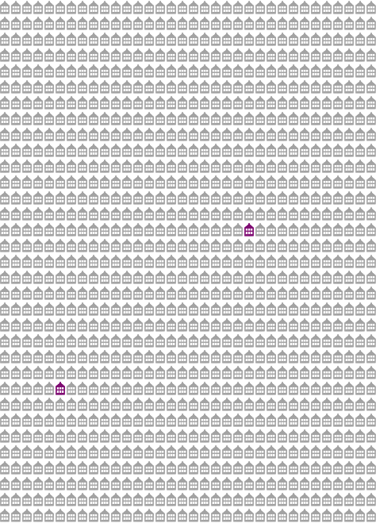{width="70%" height="70%" fig-alt="1000 kleine Häuser, in einem Raster angeordnet, 2 Häuser sind lila, die anderen grau"}</div>
:::

::: {#cr-viele-haushalte-2-lila-stichprobe}
<div style="text-align:center">{width="70%" height="70%" fig-alt="1000 kleine Häuser, in einem Raster angeordnet, 2 Häuser sind lila, die anderen grau, einige graue Häuser und ein lila Haus werden von einem Rechteck umschlossen"}</div>
:::

::: {#cr-viele-haushalte-2-lila-stichprobe-verweigerung}
<div style="text-align:center">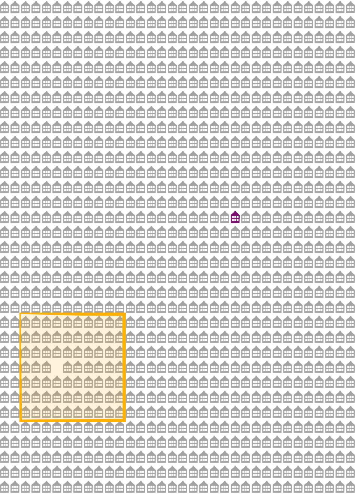{width="70%" height="70%" fig-alt="Gleiches Bild, das lila-farbene Haus ist jedoch verschwunden"}</div>
:::

::: {#cr-vermoegen-untererfassung}
<div style="text-align:center">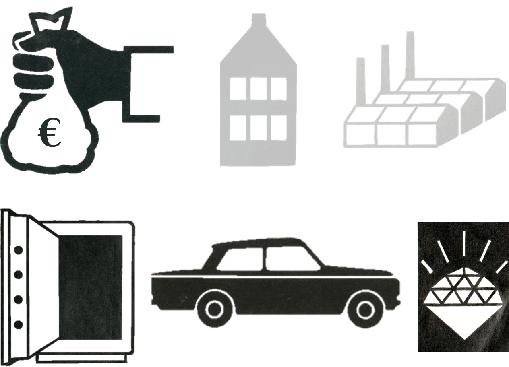{width="632px" height="456px" fig-alt="Ein Bild mit Symbolen verschiedener Vermögensarten. Ein Haus und eine Fabrik sind ausgegraut"}</div>
:::


@cr-viele-haushalte-2-lila <em>Nicht-Beobachtung:</em><br><br>
<span class="highlighted-text highlighted-text-purple">Sehr vermögende Haushalte</span> sind sehr selten.

@cr-viele-haushalte-2-lila-stichprobe Bei einer <span class="highlighted-text highlighted-text-orange">zufälligen Stichprobe</span> ist die Chance daher sehr gering, dass überhaupt einer dieser wenigen Multimillionäre oder Milliardäre ausgewählt wird. Da ihre Vermögen in der Rechnung fehlen, wird das Gesamtvermögen eines Landes unterschätzt.

@cr-viele-haushalte-2-lila-stichprobe-verweigerung <em>Systematische Antwortverweigerung:</em><br><br>
Studien zeigen, dass besonders reiche Menschen seltener bereit sind, Auskunft über ihr Vermögen zu geben. Wenn aber gerade die Spitzenreiter die Antwort verweigern, entsteht ein verzerrtes Bild (Selektionsbias), und die Schere zwischen Arm und Reich erscheint kleiner, als sie in der Realität ist.

@cr-vermoegen-untererfassung <em>Untererfassung:</em><br><br>
Selbst wenn reiche Haushalte an der Umfrage teilnehmen, geben sie oft nicht den vollen Wert ihres Besitzes an. Das kann absichtlich geschehen (um den Reichtum zu verbergen) oder unabsichtlich (weil der genaue Wert von Immobilien oder Firmenanteilen schwer zu schätzen ist). In beiden Fällen werden die Zahlen in der Statistik zu niedrig angesetzt.

:::


## Wie kann man sich der tatsächlichen Vermögensverteilung annähern?

Um ein realistisches Gesamtbild zu zeichnen, können die Befragungsdaten anhand der trend.-Reichstenliste ergänzt werden. Dieses Verfahren macht jene Vermögen sichtbar, die in der Haushaltsbefragung sonst unterrepräsentiert bleiben.


Zwischen dem Vermögen des <span class="highlighted-text highlighted-text-purple">reichsten Haushalts der Umfrage</span> (ca. 12 Mio. Euro) und dem Vermögen auf dem <span class="highlighted-text">untersten Rang der Reichstenliste</span> (290 Mio. Euro) klafft ein riesiges Loch.

<br>
```{r circle-chart, out.width = "95%", fig.width=8}
library(ggplot2)
df_rich <- data.frame(
  label = c("Reichster Haushalt in der Umfrage",
            "Unterster Rang der Reichenliste"),
  net_worth = c(12, 290)
)

ggplot(df_rich, aes(x = 1, y = 1)) +
  geom_point(
    aes(size = net_worth, color = label),
    stroke = 0.5) +
  geom_text(
    aes(label = paste(net_worth, "Mio.\nEUR")),
    color = "white", family = "Roboto Bold"
  ) +
  scale_x_discrete(position = "top") +
  scale_size_area(max_size = 120) +
  scale_color_manual(values = c("#933689", "#32322D")) +
  coord_cartesian(clip = "off") +
  guides(size = "none", color = "none") +
  facet_wrap(vars(label)) +
  theme_void(base_family = "Playfair Display", paper = "#F1F1F1") +
  theme(
    strip.text = element_text(size = 14, lineheight = 2),
    panel.spacing.x = unit(2, "cm")
  )

```

Mithilfe der Pareto-Verteilung lässt sich mathematisch herleiten, wie sich das Vermögen in der Gruppe der sehr Reichen wahrscheinlich verteilt. Das Modell erlaubt es, die statistische Lücke zwischen der breiten Bevölkerung und den Superreichen präzise zu schließen, indem es die Anzahl und den Reichtum jener Haushalte schätzt, die von herkömmlichen Umfragen nicht erfasst werden.

Ab einer Grenze von vier Millionen Euro werden die Befragungswerte durch statistisch modellierte Haushalte ersetzt. Ziel ist es, die tatsächliche Konzentration am oberen Rand der Verteilung in Österreich realitätsgetreu abzubilden.

Damit statistische Ausreißer das Ergebnis nicht künstlich aufblähen, wurde eine Obergrenze eingezogen: Vermögenswerte werden bei zehn Milliarden Euro gedeckelt. Selbst wenn das mathematische Modell theoretisch noch höhere Extremwerte zulassen würde, stellt dieser &bdquo;Deckel&rdquo; sicher, dass das Gesamtbild nicht durch einzelne Schätzwerte verzerrt wird.

Nach dieser statistischen Anpassung zeigt sich ein genaueres Bild der der Vermögen in der Spitze.


Die Vermögensverteilung in Österreich stellt sich nun wie folgt dar:

::: cr-section

::: {#cr-muenzen-top-1-roh}
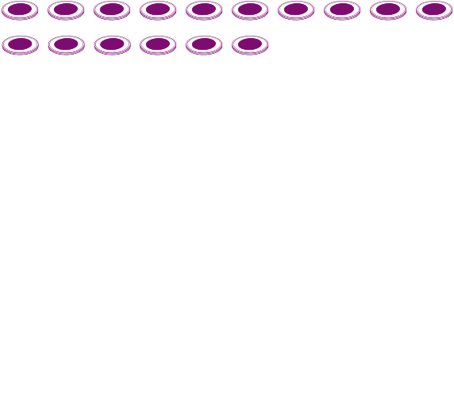
:::

::: {#cr-muenzen-top-1-adj}
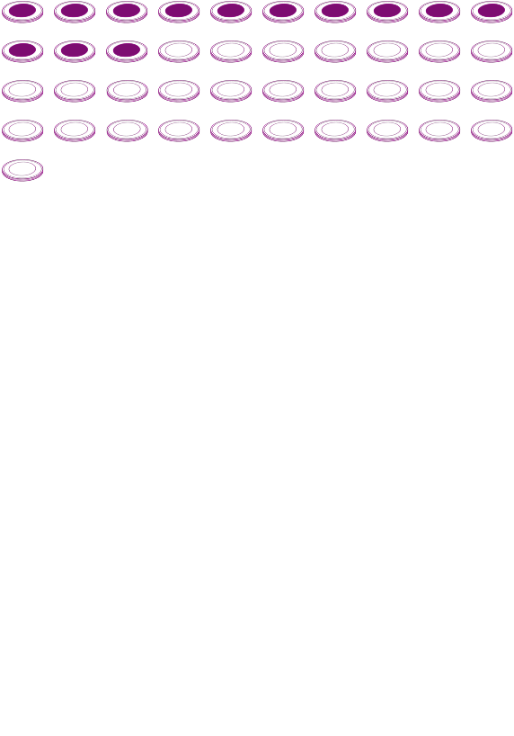
:::


::: {#cr-haushalte-1-lila-99-grau}
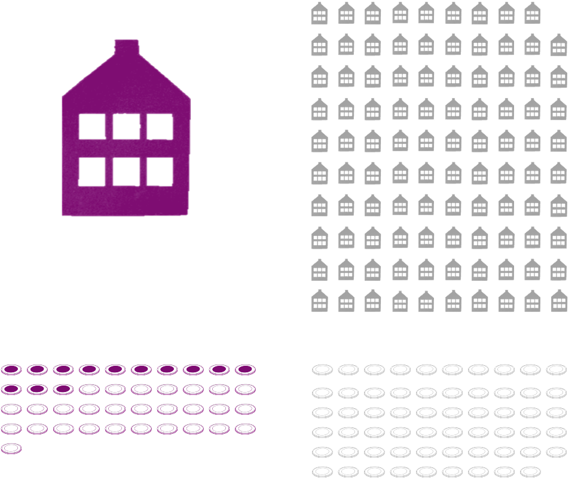
:::


::: {#cr-haushalte-1-lila-9-blau-90-grau}
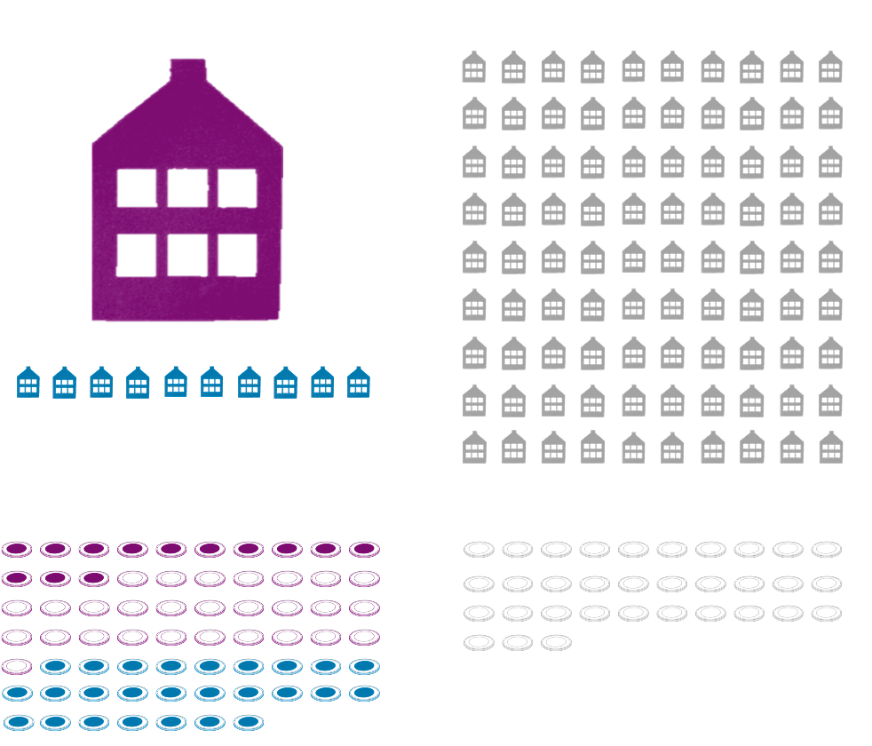
:::


::: {#cr-haushalte-untere50-adj}
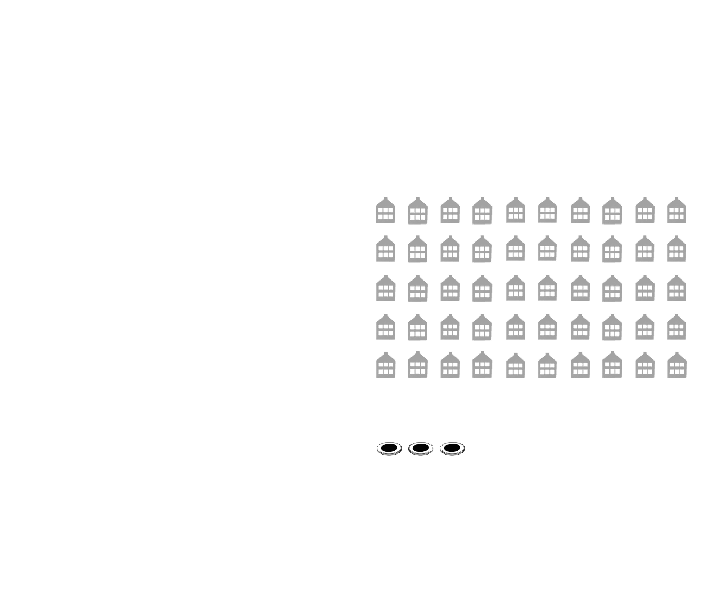
:::


@cr-muenzen-top-1-roh Auf Grundlage der Befragungsdaten besitzt das <span class="highlighted-text highlighted-text-purple">oberste Prozent der Haushalte</span> 16 Prozent der privaten Vermögen in Österreich.

@cr-muenzen-top-1-adj Wenn man mit dem beschriebenen Verfahren schätzt, wie hoch das tatsächliche Vermögen des obersten Prozent ausfällt, dann sind es allerdings <em>41 Prozent</em>.

@cr-haushalte-1-lila-99-grau <span class="highlighted-text highlighted-text-purple">Ein Haushalt</span> besitzt mit 41 % also gar nicht so viel weniger als die <span class="highlighted-text highlighted-text-grey">99 übrigen Haushalte</span>.

@cr-haushalte-1-lila-9-blau-90-grau Wenn man das Vermögen der oberen zehn Prozent zusammennimmt, dann ist diese Vermögen doppelt so hoch wie das der übrigen 90 Haushalte.

Und die untere Hälfte der Haushalte?

@cr-haushalte-untere50-adj Ihr Anteil am Gesamtvermögen privater Haushalte beträgt nach der Anpassung lediglich <span class="highlighted-text">drei Prozent</span> (statt fünf Prozent).


:::


Erst der Blick hinter die statistischen Lücken zeigt: Reichtum ist in Österreich weit konzentrierter, als es einfache Umfragen vermuten lassen. Diese Transparenz ist die notwendige Grundlage für jede sachliche Debatte darüber, wie Wohlstand und Verantwortung in Zukunft verteilt sein sollen.


<br><br><br><br><br><br><br>


## Quellen

Die hier dargestellten Erkenntnisse und Verteilungen basieren auf der Arbeit von <em>Ines Heck, Anna Hornykewycz, Jakob Kapeller und Rafael Wildauer</em> (2024): Vermögensverteilung in Österreich: Eine Analyse auf Basis des HFCS 2021/22. In: Materialien zu Wirtschaft und Gesellschaft Nr. 255. [Working Paper-Reihe der AK Wien](https://emedien.arbeiterkammer.at/viewer/image/AC17296950/).


### Weitere Quellen

* Isotypen: Gerd Arntz Web Archive: [https://www.gerdarntz.org/isotype.html](https://www.gerdarntz.org/isotype.html), digital bearbeitet
* Bundeszentrale für politische Bildung: [https://www.bpb.de/kurz-knapp/lexika/lexikon-der-wirtschaft/21004/vermoegen/](https://www.bpb.de/kurz-knapp/lexika/lexikon-der-wirtschaft/21004/vermoegen/)
* Household Finance and Consumption Survey 2021: [https://www.hfcs.at/ergebnisse-tabellen/hfcs-2021.html](https://www.hfcs.at/ergebnisse-tabellen/hfcs-2021.html), Standard-Output-Tabellen ([Download](https://www.hfcs.at/dam/jcr:d1b35868-6ebc-4f29-90a8-d0e40df9369c/HFCS-AT-2021-Standard-Output-Tabellen.xlsx))
* Statistik Austria: [https://www.statistik.at/statistiken/bevoelkerung-und-soziales/bevoelkerung/familien-haushalte-lebensformen/privathaushalte](https://www.statistik.at/statistiken/bevoelkerung-und-soziales/bevoelkerung/familien-haushalte-lebensformen/privathaushalte)
