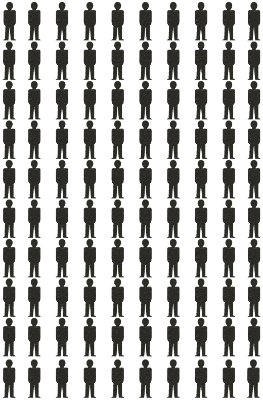
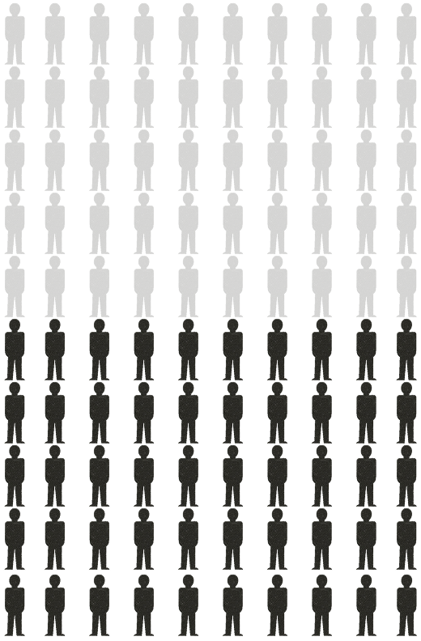
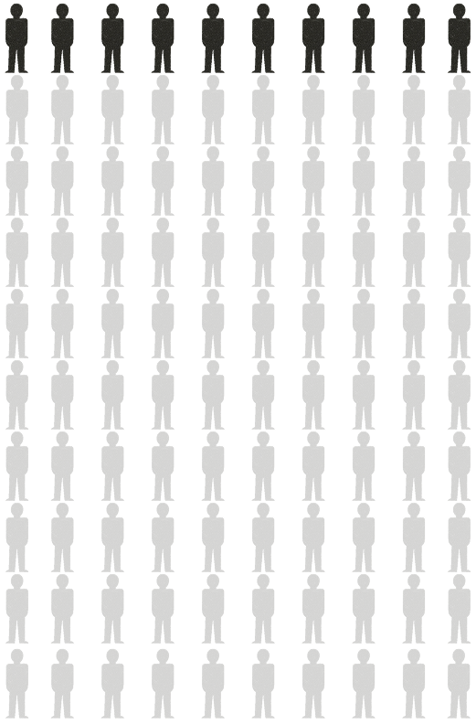
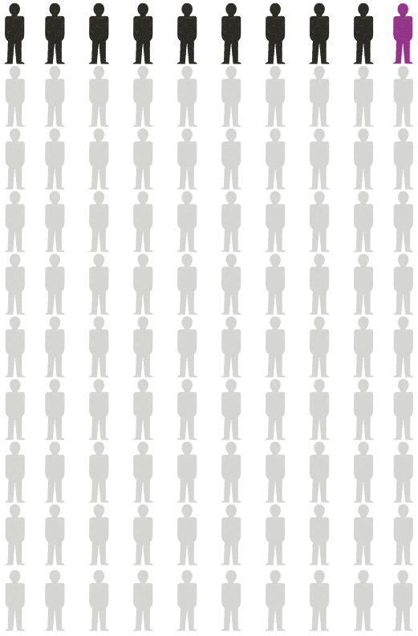
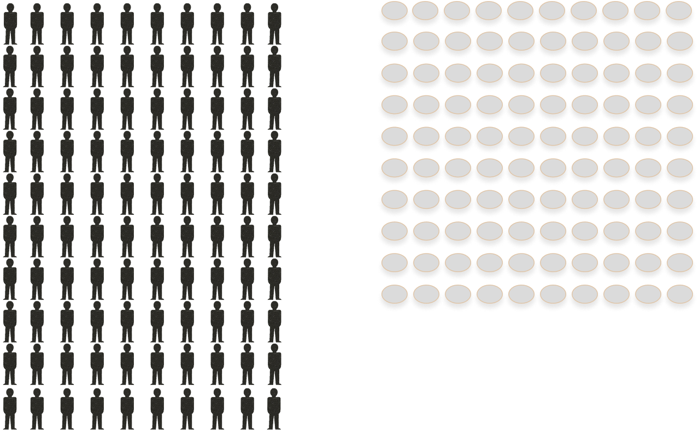
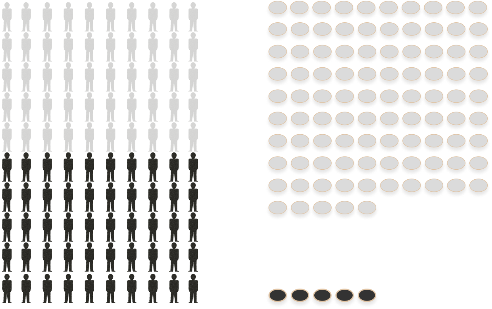
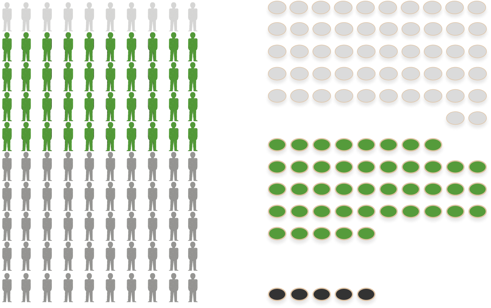
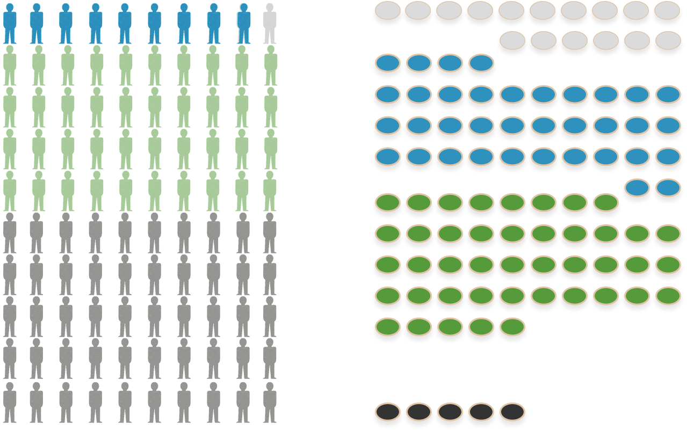

::: cr-section

::: {#cr-100-people}

:::

::: {#cr-100-people-semitransparent}
{style="opacity: 0.1;"}
:::

::: {#cr-100-people-50percent}

:::

::: {#cr-100-people-10percent}

:::

::: {#cr-100-people-1percent}

:::

::: {#cr-vermoegen}

:::

@cr-100-people Stelle dir vor, diese <em>100 Personen</em> stehen für die gesamte Bevölkerung Österreichs. <em>Eine Person repräsentiert 1 % der österreichischen Haushalte</em>. 🇦🇹   Jeder Haushalt besitzt ein bestimmtes Vermögen.

@cr-100-people-50percent Dann sind diese 50 Personen hier die Hälfte der Haushalte.  Wenn man die Bevölkerung nach der Höhe ihres Vermögens ordnet, dann ist dies die  Hälfte der Haushalte mit dem geringsten Vermögen.

Diese zehn Haushalte besitzen das höchste Vermögen. @cr-100-people-10percent 

@cr-100-people-1percent Und dann gibt es unter diesen zehn Haushalten einen Haushalt mit dem höchsten Vermögen.

@cr-100-people-semitransparent Wie teilt sich nun das Vermögen unter diesen 100 Haushalten in Österreich auf?

@cr-vermoegen Vermögen sind alle in Geld bewerteten dauerhaften Güter und Rechte wie Grundbesitz, Wertpapiere oder Bargeld einer Person oder eines privaten Haushalts.

:::

::: cr-section

::: {#cr-vermoegen-vergleich-1}
{height="4000px"}
:::

[@cr-vermoegen-vergleich-1] Hier vergleichen wir das mittlere Vermögen der unteren Hälfte der Haushalte, das mittlere Vermögen aller Haushalte und das durchschnittliche Vermögen des obersten Prozents.

[@cr-vermoegen-vergleich-1]{pan-to="0%,-20%"} Weiterscrollen!

[@cr-vermoegen-vergleich-1]{pan-to="0%,-40%"} Haushalte, die Vermögen von mehr als 2,64 Mio. EUR besitzen, gehören zum obersten Prozent.

[@cr-vermoegen-vergleich-1]{pan-to="0%,-80%"} Und durchschnittlich besitzen diese Haushalte 4,92 Mio. EUR.

:::

::: cr-section

::: {#cr-vermoegen-vergleich-1-klein}
{height="1000px"}
:::

[@cr-vermoegen-vergleich-1-klein] Also noch einmal auf einer Bildschirmseite.

:::

::: cr-section

::: {#cr-people-vermoegen-start}

:::

::: {#cr-people-vermoegen-untere50}

:::

::: {#cr-people-vermoegen-51bis11}

:::

::: {#cr-people-vermoegen-10bis2}

:::

@cr-people-vermoegen-start Los gehts!

@cr-people-vermoegen-untere50 Die untere Hälfte der Haushalte verfügt über fünf Prozent des gesamten Vermögens privater Haushalte.

@cr-people-vermoegen-51bis11 Die nächsten 40 Prozent der Haushalte (51. bis 11. Perzentil) verfügen über 43 Prozent.

@cr-people-vermoegen-10bis2 Die nächsten 9 Prozent der Haushalte (10. bis 2. Perzentil) verfügen über 36 Prozent.

:::

## Quellen

* Heck, Ines, Anna Hornykewycz, Jakob Kapeller, Rafael Wildauer (2024): Vermögensverteilung in Österreich: Eine Analyse auf Basis des HFCS 2021/22. In: Materialien zu Wirtschaft und Gesellschaft Nr. 255. Working Paper-Reihe der AK Wien.
* Isotypen: Gerd Arntz Web Archive: [https://www.gerdarntz.org/isotype.html](https://www.gerdarntz.org/isotype.html), digital bearbeitet
* Bundeszentrale für politische Bildung: [https://www.bpb.de/kurz-knapp/lexika/lexikon-der-wirtschaft/21004/vermoegen/](https://www.bpb.de/kurz-knapp/lexika/lexikon-der-wirtschaft/21004/vermoegen/)
* Household Finance and Consumption Survey 2021: [https://www.hfcs.at/ergebnisse-tabellen/hfcs-2021.html](https://www.hfcs.at/ergebnisse-tabellen/hfcs-2021.html), Standard-Output-Tabellen ([Download](https://www.hfcs.at/dam/jcr:d1b35868-6ebc-4f29-90a8-d0e40df9369c/HFCS-AT-2021-Standard-Output-Tabellen.xlsx))
